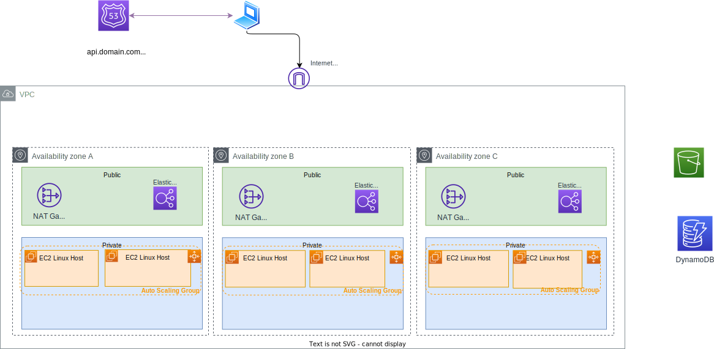

# AWS Resiliency Studies

This repository includes IaC to prepare environment for HA and resiliency and try to do some chaos engineering. This is for beginner readers.

As illustrated in this diagram, when we want to address Resiliency we need to cover DR and Availability:


## CDK stacks

### Networking

The first stack is to define a VPC with 3 AZ, 3 public subnets, 3 private subnets, NAT gateways, routes, and Network load balancer which should match the following diagram:


To create the stack see the `networking` folder and use cdk CLI.

```sh
cdk synth
cdk deploy
```

Here are the resource created:

* One internet gateway, 3 NAT gateways, one in each in public subnet. Each NAT gateway has a Elastic Network Interface with public and private IP addresses.
* 3 route tables, one in each public subnet and one in each private subnet
* 3 route tables for the private subnet, that have egress route to NAT
* Security groups
* IAM role for the lambda function to assume, so it can update security groups in VPC
* Lambda function for removing all inbound/outbound rules from the VPC default security group

#### What supports HA in this stack

* 3 AZs with expected routing to authorize ingress traffic on HTTP port 80, and egree via NAT gateways. Any EC2 deployed in the private subnets can fail, a load balancer will route traffic to the one alive.
* With very low latency network between AZs we can do insynch replicas.

#### Disaster recovery

For one Availability Zone failure, the current topology guaranty services availability. For region recovery, there is nothing in this stack that will help.

### Basic EC2 stack

To test resiliency a second stack is to get some back end systems deployed in private subnet. 




* The security defines ingress rule for CIDR of the VPC.

#### What supports HA in this stack

Same as above the 3 AZ helps to support one AZ failure, and auto scaling group help to scale EC2 resources in each AZ.

#### Disaster recovery

In case of region failures, the same stacks are applied in another region. Route 53 DNS name need to be updated to go to the DR region.

## Body of knowledge

* My product agnostic notes on [Disaster Recovery](https://jbcodeforce.github.io/architecture/DR/)
* AWS resiliency [personal notes](https://jbcodeforce.github.io/aws-studies/sa/resiliency/)
