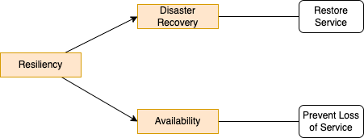
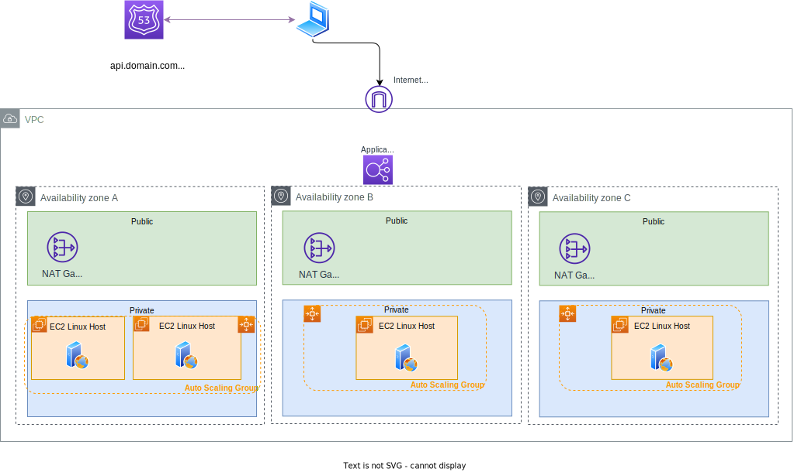

# AWS Resiliency Studies

This repository includes IaC to prepare environment for HA and resiliency and try to do some chaos engineering. This is for beginner readers.

As illustrated in this diagram, when we want to address Resiliency we need to cover DR and Availability:



## Requirements

The following are requirements supported by this repository

* Define a reusable VPC with 3 AZs 3 public subnets and 3 private subnets. One internet gateway, 3 NAT gateways, one in each in public subnet. Three route tables, one in each public subnet and one in each private subnet. Three route tables for the private subnet, that have egress route to NAT Gateway. IAM role to update security group in VPC. A Lambda function for removing all inbound/outbound rules from the VPC default security group. This is supported by the cdk stack: `NetworkingStack`.
* Add three auto scaling group, one per AZ. 
* Deploy Application Load Balancer to target auto scaling group

Items to cover:

* [ ] route 53 configuration with ARC

## Solution Stacks

### Networking Stack

The first stack is to define a VPC with 3 AZ, 3 public subnets, 3 private subnets, NAT gateways, routes, and Network load balancer which should match the following diagram:


To create the stack see the `networking` folder and use cdk CLI.

```sh
# under solution_iac folder
cdk synth
cdk deploy
```

Here are the resource created:

* One internet gateway, 3 NAT gateways, one in each in public subnet. Each NAT gateway has a Elastic Network Interface with public and private IP addresses.
* 3 route tables, one in each public subnet and one in each private subnet
* 3 route tables for the private subnet, that have egress route to NAT
* Security groups
* IAM role for the lambda function to assume, so it can update security groups in VPC
* Lambda function for removing all inbound/outbound rules from the VPC default security group

#### What supports HA in this stack

* 3 AZs with expected routing to authorize ingress traffic on HTTP port 80, and egree via NAT gateways. Any EC2 deployed in the private subnets can fail, a load balancer will route traffic to the one alive.
* With very low latency network between AZs we can do insynch replicas.

#### Disaster recovery

For one Availability Zone failure, the current topology guaranty services availability. For region recovery, there is nothing in this stack that will help. But the fact to use CDK, so CloudFormation template, it is easy to set this VPC in another region but running `cdk deploy` in a DR region.

### Basic EC2 stack

The backend deployment is supporting simple 
To test resiliency a second stack is to get some back end systems deployed in private subnet. 




* The security defines ingress rule for CIDR of the VPC.

#### What supports HA in this stack

Same as above the 3 AZ helps to support one AZ failure, and auto scaling group help to scale EC2 resources in each AZ.

#### Disaster recovery

In case of region failures, the same stacks are applied in another region. Route 53 DNS name need to be updated to go to the DR region.

## Body of knowledge

* My product agnostic notes on [Disaster Recovery](https://jbcodeforce.github.io/architecture/DR/)
* AWS resiliency [personal notes](https://jbcodeforce.github.io/aws-studies/sa/resiliency/)

* [Well-architected- DR objectives](https://docs.aws.amazon.com/wellarchitected/latest/reliability-pillar/disaster-recovery-dr-objectives.html)
* [Amazon DR whitepaper](https://docs.aws.amazon.com/whitepapers/latest/disaster-recovery-workloads-on-aws/disaster-recovery-workloads-on-aws.html)
* [AWS doc - Disaster recovery implementation](https://docs.aws.amazon.com/whitepapers/latest/disaster-recovery-of-on-premises-applications-to-aws/disaster-recovery-implementation.html)
* [Principle of Chaos engineering](https://principlesofchaos.org)
* [Testing Resilience of EC2, RDS, and AZ using Chaos Engineering - AWS workshop](https://catalog.workshops.aws/well-architected-reliability/en-US/4-failure-management/4-test/30-testing-for-resiliency-of-ec2-rds-and-s3)

* [Cell based architecture](https://aws.amazon.com/solutions/guidance/cell-based-architecture-on-aws/)
* [AWS Fault Injection Simulator supports chaos engineering experiments on Amazon EKS Pods.](https://aws.amazon.com/blogs/containers/aws-fault-injection-simulator-supports-chaos-engineering-experiments-on-amazon-eks-pods/)
* [Simulating Kubernetes-workload AZ failures with AWS Fault Injection Simulator](https://aws.amazon.com/blogs/architecture/simulating-kubernetes-workload-az-failures-with-aws-fault-injection-simulator/)